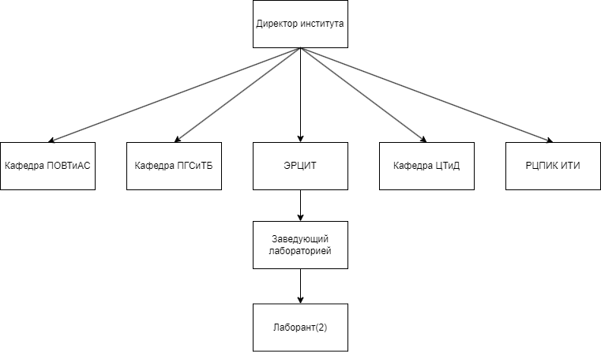

#### ***Сайт для лаборатории 503.***

***1 Характеристика предприятия***

**1.1. ЭЦИТ ХГУ им. Н.Ф. Катанова: сфера деятельности
предприятия, структура и подчиненность**

Экспериментальный ресурсный центр инженерных технологий (ЭРЦИТ)
[[1]](http://iti.khsu.ru/sveden/ercit)

**Цель Центра:** консолидация научно-методического и
научно-технического потенциалов Института для развития современной
образовательно-профессиональной среды, способствующей повышению
эффективности профессиональной подготовки обучающихся по основным и
дополнительным образовательным программам за счет гармонизации
практико-ориентированного обучения и научно-исследовательской
деятельности.

**Местонахождение Лаборатории [[2]](http://хгу.рф/):** 655017, Республика Хакасия, город
Абакан, проспект Ленина, д. 92/1, каб. 503

**Основными виды деятельности «ЭРЦИТ» являются [[3]](http://iti.khsu.ru/files/science/inform/polozhenie_ob_erczit_iti.pdf):**

+ Создание условий для формирования знаний и практических
  навыков, мотивации и творческих способностей обучающихся Института в
  области сетевых технологий, телекоммуникаций, информационной
  безопасности, информационных систем и робототехники;
+ Cоздание, поддержка и развитие на базе Центра лабораторно-экспериментального кластера Института (лабораторий, экспериментальных площадок и платформ) для консолидации научно-методического и научно-технического потенциалов Института;
+ Реализация практико-ориентированного обучения, в том числе
  создание базы для проведения специализированных практических занятий,
  учебных и производственных практик, вовлечение обучающихся в реальную
  проектную деятельность в процессе обучения;
+ Организация работы проектных групп, действующих на базе Центра
  и его лабораторно-экспериментального кластера;
+ Разработка методических материалов и рекомендаций на основе
  экспериментальной и научно-практической деятельности Центра, а также поддержка и осуществление деятельности лабораторно-экспериментального
  кластера Института (лабораторий, экспериментальных площадок и платформ)
  в этом направлении;
+ Обеспечение проведения НИР и НИРС в области инженерных
  технологий, включая, но не ограничиваясь: информационными технологиями,
  различными аспектами цифровизации общества, технологиями легкой
  промышленности, системами искусственного интеллекта и роботизации,
  технологиями в области строительства и инженерной экологии;
+ Формирование предложений по открытию новых проектов по
  тематике Центра, с целью участия в конкурсах, выставках, грантах вузовского,
  межвузовского, регионального и федерального уровней;
+ Организация и участие в мероприятиях, направленных на
  повышение имиджа и престижа инженерного образования и популяризацию
  современных информационных технологий (олимпиады, мастер-классы,
  турниры, выставки, конкурсы, чемпионаты, фестивали технического
  творчества, встречи и т.д.);
+ Взаимодействие с работодателями, посредством реализации
  совместных проектов и разработок на базе лабораторно-экспериментального
  кластера Института (лабораторий, экспериментальных площадок и платформ);
+ Участие в федеральных проектах;
  распространение положительного опыта деятельности Центра
  посредством взаимодействия с другими образовательными учреждениями
  Российской Федерации различного уровня.

**Функции Лаборатории:**

+ Создание, поддержка и развитие на базе Центра лабораторно-экспериментального кластера Института (лабораторий, экспериментальных
  площадок и платформ) для консолидации научно-методического и научно-технического потенциалов Института;
+ Реализация практико-ориентированного обучения, в том числе
  создание базы для проведения специализированных практических занятий, учебных и производственных практик, вовлечение обучающихся в реальную проектную деятельность в процессе обучения;
+ Организация работы проектных групп, действующих на базе Центра
  и его лабораторно-экспериментального кластера;
+ Разработка методических материалов и рекомендаций на основе
  экспериментальной и научно практической деятельности Центра, а также поддержка и осуществление деятельности лабораторно-экспериментального кластера Института (лабораторий, экспериментальных площадок и платформ) в этом направлении;
+ Обеспечение проведения НИР и НИРС в области инженерных
  технологий, включая, но не ограничиваясь: информационными технологиями, различными аспектами цифровизации общества, технологиями легкой промышленности, системами искусственного интеллекта и роботизации, технологиями в области строительства и инженерной экологии;
+ Формирование предложений по открытию новых проектов по
  тематике Центра, с целью участия в конкурсах, выставках, грантах вузовского, межвузовского, регионального и федерального уровней;
+ Организация и участие в мероприятиях, направленных на повышение имиджа и престижа инженерного образования и популяризацию
  современных информационных технологий (олимпиады, мастер классы,
  турниры, выставки, конкурсы, чемпионаты, фестивали технического
  творчества, встречи и т.д.);
+ Взаимодействие с работодателями, посредством реализации
  совместных проектов и разработок на базе лабораторно экспериментального
  кластера Института (лабораторий, экспериментальных площадок и платформ);
+ Участие в федеральных проектах;
+ Распространение положительного опыта деятельности Центра посредством взаимодействия с другими образовательными учреждениями Российской Федерации различного уровня.

**1.2 Организационная структура и порядок управления**

Структура Лаборатории устанавливается на основе штатного
расписания, утвержденного ректором Университета по преставлению
директора Института, с учётом целей и задач Института.
Организационная структура Лаборатории включает в себя
начальника Лаборатории и лаборантов согласно штатному расписанию.
Сотрудники Лаборатории назначаются и увольняются приказом
ректора Университета по представлению начальника Лаборатории,
согласованному с директором Института. Квалификационные требования к
сотрудникам Лаборатории регламентируются должностными инструкциями.
Начальник Лаборатории подчиняется непосредственно директору
Института.
Подчиненность предприятия «ЭРЦИТ» Инженерно-технологического
института ХГУ им. Н.Ф. Катанова представлена на рисунке 1

Структура предприятия «ЭРЦИТ»

**Компетенция начальника центра:**

+ Осуществляет руководство
  деятельностью центра в пределах своей компетенции, определенной настоящим положением, трудовым договором, должностными инструкциями, распоряжениями директора Института, иными внутренними локальными актами Университета;
+ Действует от имени и в интересах Университета по всем делам,
  связанным с деятельностью Лаборатории, в рамках своих полномочий;
+ Исполняет приказы, распоряжения и указания вышестоящих
  руководителей в порядке их подчиненности, отданные в пределах их должностных полномочий, за исключением незаконных;
+ Распределяет обязанности между сотрудниками Лаборатории;
+ Организует планирование деятельности и обеспечивает выполнение
  задач и функций Лаборатории, в соответствии с Планом работ Института;
+ Может являться руководителем проектных групп, действующей на
  базе Лаборатории. Руководителями проектной группы могут являться и другие сотрудники Университета по согласованию с начальником Лаборатории и директором Института.

**Внешние связи**

На рисунке представлена схема внешних связей Центра.

Центр связан с многими отделами:

* дирекция – управляющий орган Центра Института, утверждающий
  бюджет Центра;
* кафедры института – как учебная, так и научная деятельность
  направлений подготовки;
* ресурсный центр подготовки инженерных кадров ИТИ – обучение и
  подготовка инженерных кадров в сфере информационных систем и
  технологий;
* исполнительные, судебные и законодательные органы Российской
  Федерации – урегулирование нормативно-правовых актов и законов,
  введенных высшими органами власти;
* образовательные учреждения Хакасии и других субъектов
  Российской Федерации – привлечение школьников и студентов в
  Университет, путем реализации мастер-классов и иных показательных уроков
  на базе Центра;
* бухгалтерия Университета – финансирование Центра;
* колледжи и институты Университета – использование Центра как
  учебной, так и научной деятельности другими учебными подразделениями
  Университета;
* административные органы и проректорский состав Университета –урегулирование прав и обязанностей внутри вуза;
  проректорский состав университета – урегулирование прав и
  обязанностей внутри вуза.

**Выводы**
Приведена характеристика организации, а именно: наименование,
территориальное расположение и основные виды деятельности. Также
рассмотрена организационная структура и задачи функционирования.
Описаны внешние связи организации.
В ходе анализа информационной системы выявлен существенный
недостаток. Директору и работникам Центра необходимо собирать
необходимую информацию с компьютеров центра в виде аппаратных и
программных характеристик компьютера, а также проводить диагностику системы компьютеров в целом.

