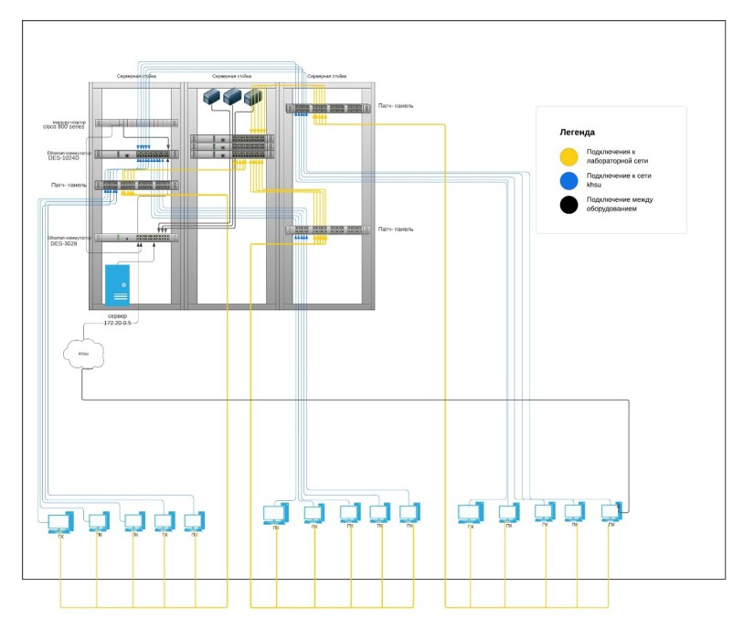

Центр использует иерархическую модель данных, где используется
представление базы данных в виде древовидной структуры, состоящей из данных различных уровней. Кабинет имеет отдельную локальную сеть топологии «Звезда» и связана с главной информационной системой через маршрутизатор. В свою очередь к маршрутизатору подключен коммутатор для соединения несколько ЭВМ (электронно-вычислительная машина) в одну компьютерную сеть. На рисунке ниже представлена информационная система Экспериментального ресурсного центра инженерных технологий.

Информационная система Экспериментального ресурсного центра иинженерных технологий

В центре организована своя внутренняя сеть 172.20.0.N, с сервером
172.20.0.5 это необходимо для того чтобы внешние факторы такие как, работа с оборудованием, занятия по сетевым дисциплинам и возможные неполадки не сказались на работе общей сети университета.
В связи с тем, что Университет финансирует Центр, рабочие места, а также рабочее место директора Центра имеют одинаковые характеристики технического обеспечения. Характеристика технического обеспечения представлена в таблице.

*Характеристика технического обеспечения рабочих мест*

Название технического обеспечения | Характеристики
---  |   ---
Системный блок | Процессор: Intel i3-4460 
| | Оперативная память: 8182 Мб 
| |Материнская плата: Gigabyte H81M – 32PV
| |Жесткий диск:  Seagate 1000
| | Видеокарта: NVIDIA GeForce GT610|
Монитор | Viewsonic VA2246a-LED
Маршрутизатор | ASUS DSL-N11
Коммутатор | D-Link DES-3528

Центр соответствует всем стандартам Положения о
Компьютеризированной аудитории [[3]](http://iti.khsu.ru/files/science/inform/polozhenie_ob_erczit_iti.pdf).
На рабочих местах Центра установлено следующее программное
обеспечение:

* на рабочих местах Центра используется операционная система
  Windows 7 Professional x64 (учебные ЭВМ 11 штук и 1 рабочее место директора Центра) и Windows Server 2008 R2 (ЭВМ-сервер);
* для ведения текущей документации и подготовки отчетов сотрудники Центра используют офисный пакет приложений Microsoft Office 2016, а именно: MS Word, MS Excel, MS PowerPoint, MS Access;
* для выхода в интернет в целях найти необходимую информацию
  установлены следующие браузеры: Yandex 22.5.4 и Google Chrome
  102.0.5005.61/63;
* для чтения PDF файлов Foxit PDF Reader 11.2.1.53537;
* для реализации задач Центра в конкретных проектах, по мере
  необходимости, работниками Центра устанавливается дополнительное ПО: Autodesk AutoCAD 2020, Mathcad 15 M045, ADOBE PHOTOSHOP 2018, Arduino IDE 1.8.19, Kleopatra и т.д.

В компьютерах имеется 2 сетевых подключения:

1. 172.20.0.N - Для занятий и доступа в образовательные ресурсы ХГУ к серверу 172.20.0.5 где студенты могут обмениваться и использовать информацию которою разместит там преподаватель.
2. 10.90.90.90 – Лабораторная сеть, предназначенная для работы с оборудованием на лабораторных работах по сетевым дисциплинам, которая не нарушит работоспособность сети центра.

Сотрудникам Центра при получении запроса на подготовку Центра к
учебному процессу необходимо собирать необходимую информацию с ЭВМ центра в виде файлов или аппаратных и программных характеристик компьютера, а также проводить диагностику системы компьютера в целом. Зачастую данная проблема усложняется тем, что работник отсутствует в аудитории (центре) и не может оперативно управлять и настраивать функционал на каждом компьютере центра. Для решения недостатка принято решение внедрить программный продукт, который позволит улучшить контроль и управление компьютерами Центра, имея доступ к удаленной работе.

