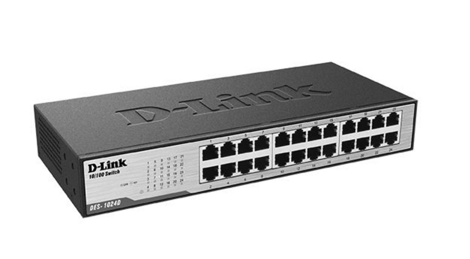

В центре в сетевых стойках расположено следующее оборудование:

### 1 DES-3028EOL EOS

DES-3028EOL - это управляемый сетевой коммутатор (switch)
производства компании D-Link, который используется для построения сетей Ethernet. Этот коммутатор имеет 24 порта 10/100 Мбит/с и 4 порта Gigabit Ethernet (10/100/1000 Мбит/с). Кроме этого, он может быть оснащен двумя 1000Base-SX портами, которые поддерживают интерфейсы оптического волокна.

EOS (End of Support) – это термин, означающий окончание технической поддержки данного устройства производителем. После окончания срока поддержки, производитель может прекратить выпускать обновления для данного устройства, устраняющие ошибки и уязвимости, а также предоставление технической поддержки по вопросам эксплуатации и настройки [[4]](https://dlink.ru/ru/products/1/706.html)

Если устройству требуется дальнейшая эксплуатация, то можно
продолжать использовать его, однако не рекомендуется использовать его в критических системах и сетях, так как отсутствие поддержки может привести к возникновению проблем и уязвимостей. Кроме того, необходимо по возможности защитить сеть и устройство от возможных угроз безопасности.

Безопасность и доступность. Коммутаторы серии DES-3028/3052
поддерживают большое количество функций безопасности, включая Access Control List (ACL), управление доступом 802.1х на основе портов / МАС-адресов, 802.1х Guest VLAN, аутентификацию RADIUS/TACACS+. Для предотвращения перегрузки коммутатора обработкой бесполезного трафика, в связи с атаками злоумышленников или активностью вирусов/червей, коммутаторы серии DES-3028/3052 снабжены функциями D-Link Safeguard Engine и CPU Interface Filtering, что увеличивает их надежность и доступность

Некоторые характеристики управляемого коммутатора DES-3028EOL
указаны в таблице: [[5]](http://digimedia.ru/articles/svyaz/setevye-tehnologii/obzor-d-link-des-3028/)

*Характеристики управляемого коммутатора DES-3028EOL*

| **Интерфейсы** | **Светодиодные индикаторы** |     
|:-------------:|:---------------:|
|24 порта 10/100Base-TX|Питание (на устройство)|
|порта 10/100/1000Base-T|Консоль (на устройство)|
|комбо-порта 10/100/1000Base-T /SFP|Link/Activity (на порт)|
|Консольный порт RS-232|Индикатор скорости (напорт)|

|**VLAN**|**Управление**|
|:-------------:|:---------------:|
|802.1Q|D-Link Single IP Management (SIM) v. 1.6|
|Количество статических групп VLAN – 4К|Web-интерфейс|
|Количество динамических групп VLAN – 200|Интерфейс командной строки (CLI)|
|GVRP|Telnet сервер/клиент|

|**Доступ к сети /Безопасность:**|**Списки управления доступом**|
|:-------------:|:---------------:|
|АутентификацияRADIUS/TACACS+ для управлениядоступом|(макс. 256 профилей / правил)|
|Создание учетных записей RADIUS для управления доступом|Многоуровневые ACL на основе:|
|Функция Port security (макс. 16 записей МАС-адресов на порт)|Номера порта|
|Управление доступом 802.1х на основе портов|VLAN ID|
||Приоритета 802.1p|
||МАС-адреса|
||IPv4|
||DSCP|
||Типа протокола|

### 2 Маршрутизатор Cisco 800

Cisco 800 - это серия маршрутизаторов (router) производства компании Cisco, предназначенных для использования в небольших офисах и для домашнего использования.
Маршрутизатор Cisco 800 обычно оснащается одним или несколькими
портами Ethernet для подключения к сети провайдера Интернет (Internet Service Provider, ISP), а также одним или несколькими портами WAN (Wide Area Network) и LAN (Local Area Network) для подключения к локальной сети.
Для обеспечения безопасности маршрутизатор Cisco 800 поддерживает
такие функции, как фильтрация адресов MAC и IP-адресов, поддержка
протоколов VPN (Virtual Private Network) и NAT (Network Address
Translation), а также система защиты от вредоносных атак. [[6]](https://www.cisco.com/c/en/us/products/routers/800-series-routers/index.html)
Маршрутизатор Cisco 800 также поддерживает множество режимов
работы, аппаратное шифрование, а также функции мониторинга и
управления, что обеспечивает удобство и простоту настройки и управления маршрутизатором.
Эта серия маршрутизаторов также характеризуется компактным
размером, низким энергопотреблением и широким диапазоном
поддерживаемых технологий (например, поддержка стандартов Wi-Fi).

Среди ключевых характеристик маршрутизатора Cisco 800 могут быть
выделены следующие:

> 1. Пропускная способность коммутации: от 50 до 200 Мбит/с.
> 2. Поддержка стандартов безопасности: VPN, NAT, SPI-брандмауэр.
> 3. Поддержка различных VPN-технологий, включая IPsec, SSL, GRE и MPLS.
> 4. Встроенные возможности аутентификации, включая RADIUS и TACACS+.
> 5. Поддержка протоколов маршрутизации, включая OSPF, BGP, RIP и EIGRP.
> 6. Возможность подключения к Internet Service Provider через Ethernetинтерфейс или 3G-модем.
> 7. Поддержка Wi-Fi-стандарта IEEE 802.11a/b/g/n с помощью
>    встроенного беспроводного модуля.
> 8. Встроенный коммутатор Ethernet с четырьмя портами 10/100 Мбит/с.
> 9. Поддержка нескольких VLAN и поддержка качества обслуживания   (QoS).
> 10. Управление маршрутизатором через веб-интерфейс, CLI (Command Line Interface), SNMP-протокол.
> 11. Энергопотребление: от 5 до 10 Вт.
> 12. Компактные размеры и возможность монтажа на стену.

### 3 Коммутационная панель (кросс-пане́ль, патч-пане́ль)

Коммутационная панель - (кросс-панель, патч-панель) — одна из
составных частей структурированной кабельной системы (СКС). Представляет собой панель с множеством соединительных разъёмов,
расположенных на лицевой стороне панели. На тыльной стороне панели находятся контакты, предназначенные для фиксированного соединения с кабелями, и соединённые с разъёмами электрически. Коммутационная панель относится к пассивному сетевому оборудованию.

### 4 DES-1024D

Неуправляемый коммутатор DES-1024D с 24 портами 10/100Base-TX
представляет собой недорогое решение для сетей SOHO и предприятий
малого и среднего бизнеса (SMB). Каждый порт коммутатора обеспечивает передачу файлов и потокового мультимедиа на скорости до 200 Мбит/с в режиме полного дуплекса без задержек. DES-1024D поддерживает технологию Plug-and-play, позволяющую подключать к нему устройства без произведения дополнительных настроек.
Он поддерживает основные сетевые протоколы, включая IEEE 802.3,
IEEE 802.3u, IEEE 802.3x, и распознает автоматически тип кабеля, что упрощает установку и настройку. Коммутатор DES-1024D оснащен
технологией Store-and-Forward, которая позволяет обрабатывать данные для оптимальной производительности сети, а также поддерживает функцию управления потоком данных (flow control) для предотвращения потери данных.
Коммутатор DES-1024D оснащен 24 портами Ethernet, что позволяет
подключать к нему до 24 устройств. Каждый порт поддерживает скорость до 100 Мбит/c, что обеспечивает достаточную скорость передачи данных для большинства приложений в домашних сетях и небольших офисах.
DES-1024D также имеет компактный дизайн с возможностью монтажа
на стойку. Его железный корпус обеспечивает защиту от случайных ударов и коррозии, что увеличивает его надежность и долговечность. В целом, DES-1024D является надежным и стабильным коммутатором, способным удовлетворить потребности небольших сетей с ограниченным бюджетом.

Некоторые из основных характеристик коммутатора DES-1024D включают:

> 1. Количество портов: 24 порта 10/100 Мбит/с.
> 2. Поддержка технологии Auto MDI/MDIX, автоматически
>    определяющей тип кабеля (прямой или перекрестный).
> 3. Поддержка технологии Auto-negotiation автоматической настройки
>    скорости и дуплексного режима порта.
> 4. Поддержка функции "store-and-forward" для максимальной
>    эффективности передачи данных.
> 5. Поддержка контроля потока данных (flow control) с помощью
>    технологии IEEE 802.3x для предотвращения потери данных.
> 6. Железный корпус, который обеспечивает защиту от случайных
>    ударов и коррозии.
> 7. Установка на стойку (rack-mountable) для удобства размещения.
> 8. Эффективное энергопотребление, что позволяет снизить затраты на электроэнергию.
> 9. Надежный и стабильный процессор, обеспечивающий высокую
>    производительность коммутатора.
> 10. Возможность автоматического обнаружения кабелей типа Category 5 и 5e.

### 5 DES-3528

DES-3528 - это 24-портовый коммутатор (switch) производства
компании D-Link[[7]](https://www.tp-link.com/ru/), который также имеет 4 комбо порта RJ45/SFP, что позволяет гибко выбирать порты для подключения устройств в зависимости от требований сети.
Он оснащен технологией управления потоком данных (flow control) и поддерживает функцию QoS (Quality of Service), что обеспечивает высокую производительность и качество обслуживания для критически важных сетевых приложений.
DES-3528 поддерживает основные сетевые протоколы, такие как IEEE
802.3, IEEE 802.3u, IEEE 802.3ab, IEEE 802.3z и IEEE 802.3x, а также многообразие сетевых сервисов, включая VLAN, Link Aggregation, Spanning Tree, IGMP snooping, ACL, и другие.
Кроме того, DES-3528 имеет возможность маршрутизации между
внутренними сегментами сети, что упрощает настройку и управление сетью. Коммутатор может использоваться в качестве ядра сети в офисной среде или в качестве коммутатора доступа в центрах обработки данных (data center).
DES-3528 также имеет панель управления с поддержкой SNMP (Simple Network Management Protocol) и возможностью удаленного управления с помощью веб-браузера.

Некоторые из основных характеристик коммутатора DES-3528 включают:

> 1. Количество портов: 24 порта 10/100 Мбит/с и 4 комбо порта
>    RJ45/SFP.
> 2. Поддержка технологии Auto MDI/MDIX, автоматически
>    определяющей тип кабеля (прямой или перекрестный).
> 3. Поддержка технологии Auto-negotiation автоматической настройки скорости и дуплексного режима порта.
> 4. Поддержка функции "store-and-forward" для максимальной
>    эффективности передачи данных.
> 5. Поддержка контроля потока данных (flow control) с помощью
>    технологии IEEE 802.3x для предотвращения потери данных.
> 6. Поддержка функции Quality of Service (QoS) для приоритизации
>    трафика и обеспечения качества обслуживания.
> 7. Поддержка многообразия сетевых сервисов, включая VLAN, Link
>    Aggregation, Spanning Tree, IGMP snooping, ACL и другие.
> 8. Возможность маршрутизации между внутренними сегментами сети.
> 9. Панель управления с поддержкой SNMP (Simple Network
>    Management Protocol) и возможность удаленного управления с помощью веб-браузера.
> 10. Железный корпус, который обеспечивает защиту от случайных
>     ударов и коррозии.
> 11. Установка на стойку (rack-mountable) для удобства размещения.
> 12. Эффективное энергопотребление, что позволяет снизить затраты на электроэнергию.

### 6 DFL-260E

DFL-260E - это многофункциональный брандмауэр (firewall)
производства компании D-Link, который предназначен для обеспечения безопасности сети в малых и средних предприятиях.
Он поддерживает различные функции защиты и управления сетью,
включая фильтрацию веб-контента, антивирусную и защиту от DoS-атак, VPN и многое другое.
DFL-260E работает на платформе открытого программного
обеспечения (Open Source Software) и поддерживает различные протоколы и стандарты сетевой безопасности, включая IPSec, SSL VPN, WEP/WPA/WPA2.
Он оснащен физическими интерфейсами, включая 8 портов
10/100/1000BASE-T, 2 порта WAN (RJ45/SFP) и 2 порта DMZ (RJ45/SFP) для максимального контроля сетевого трафика.
DFL-260E имеет надежную и стабильную архитектуру, которая
обеспечивает высокую производительность и надежность.

Некоторые из основных характеристик межсетевого экрана DFL-260E
включают:

> 1. Поддержка защиты от различных видов кибератак, включая DoS-атаки, атаки на уровне приложений, вредоносные программы, хакерские атаки
> 2. Поддержка технологии Deep Packet Inspection (DPI) для
>    идентификации и блокировки трафика с вредоносными программами, контроля доступа и управления содержимым.
> 3. Поддержка технологии Content Filtering, обеспечивающей контроль доступа к контенту в интернете.
> 4. Поддержка технологии VPN для удаленного доступа к сети с
>    обеспечением безопасного соединения.
> 5. Возможность балансировки нагрузки на нескольких интернет-каналах.
> 6. Поддержка различных протоколов и технологий, включая VLAN, QoS, NAT, SPI, и другие.
> 7. Интегрированный модуль Wi-Fi для подключения беспроводных
>    устройств к сети.

### 7 Synology DiskStation DS211

Synology DiskStation DS211 - это сетевое хранилище данных (NAS), которое позволяет хранить, организовывать и обмениваться файлами в рамках домашней или малой офисной сети. Оно имеет два отсека
для установки жестких дисков формата 3,5 дюйма, поддерживает
интерфейсы Gigabit Ethernet, USB 2.0 и множество протоколов, включая NFS, SMB, AFP, FTP и WebDAV. DiskStation DS211 поддерживает технологию шифрования AES 256-bit для защиты данных. Оно также имеет множество приложений для работы с данными, включая приложения для обмена файлами, резервного копирования, виртуализации, стриминга медиа и т.п. Встроенный веб-интерфейс с простым и интуитивно понятным пользовательским интерфейсом обеспечивает удобство работы пользователя.

Некоторые из технические характеристик представлены ниже:

> * Частота ЦП: 1,6 ГГц
> * Шина памяти: 16bit@DDR1066
> * Память: 256 МБ
> * Внутренний жесткий диск1: 2X 3,5” SATA(II) или 2X 2,5” SATA/SSD с дисковым карманом Synology типа С
> * Максимальная внутренняя емкость: 6 ТБ
> * Размер (В x Ш x Д): 161 мм X 88 мм X 218 мм

Основные характеристики Synology DiskStation DS211 представлены в таблице.

*Основные характеристики Synology DiskStation DS211*

| **Файловая система** | **Управление разделом** |
|:-------------:|:---------------:|
|EXT4|Макс. iSCSI Target/LUN: 10 / 10|
|EXT3|Тип раздела: Basic, JBOD, RAID 0, RAID 1|
|FAT32 (только внешний диск)8|Миграция RAID: с Basic на RAID 1|
|NTFS (только внешний диск)9||

|**Безопасность**|**Управление**|
|:-------------:|:---------------:|
|Служба FTP через SSL/TLS|Обновление DSM|
|Автоматическая блокировка IP-адреса|Уведомление по электронной почте|
|Брандмауэр|Уведомление по SMS|
|Зашифрованное сетевое резервирование через rsync|Настраиваемая пользовательская квота|
|Соединение с HTTPS|Поддержка DDNS|
||Настройки PPPoE|

### 8 Сетевое хранилище QNAP TS-219P+

QNAP TS-219P+ - это сетевое хранилище данных (NAS), которое позволяет хранить, организовывать и обмениваться файлами в рамках домашней или офисной сети. Оно имеет два отсека для установки 2,5" или 3,5" жестких дисков, поддерживает интерфейсы Gigabit Ethernet, USB 2.0 и eSATA, а также множество протоколов, включая NFS, SMB, AFP, FTP и WebDAV. QNAP TS-219P+ также имеет множество приложений для работы с данными, включая приложения для обмена файлами, резервного копирования, виртуализации, стриминга медиа и т.п. Встроенный вебинтерфейс с простым и интуитивно понятным пользовательским интерфейсом обеспечивает удобство работы пользователя.

Некоторые из основных характеристик QNAP TS-219P+ включают:

> 1. Два отсека для установки жестких дисков формата 3,5 дюйма, с поддержкой режимов RAID 0 и 1.
> 2. Процессор Marvell ARM с тактовой частотой 1,6 ГГц, который
>    обеспечивает быстродействие и многофункциональность устройства.
> 3. Поддержка интерфейсов Gigabit Ethernet и USB для быстрой
>    передачи данных.
> 4. Операционная система QTS, которая обеспечивает удобное
>    управление хранилищем данных.
> 5. Большое количество приложений для работы с данными, включая приложения для резервного копирования, стриминга медиафайлов, удаленного доступа и т.д
> 6. Поддержка протоколов SMB, AFP, FTP, WebDAV и NFS для
>    совместного доступа к данным.
> 7. Возможность удаленного доступа к хранилищу данных через
>    Интернет и мобильные устройства.

